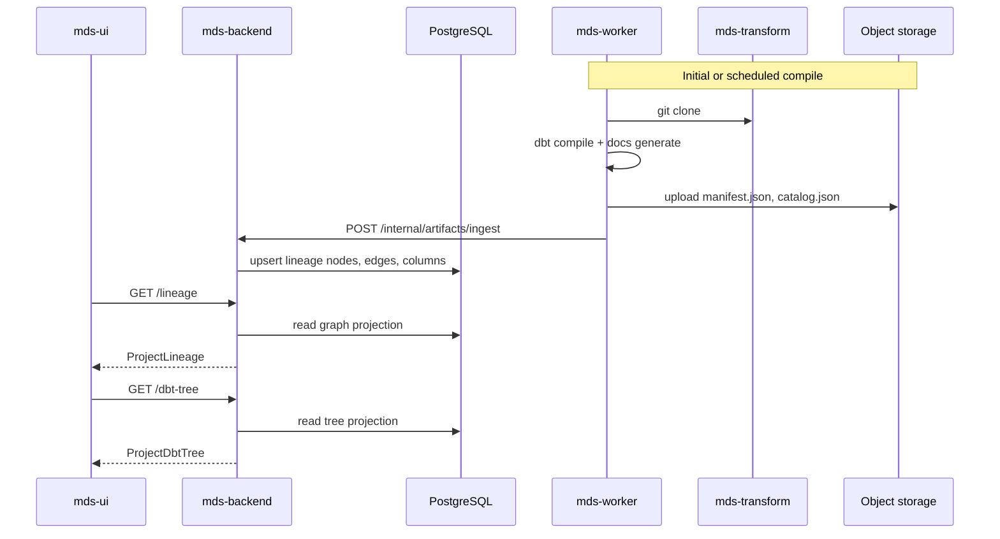
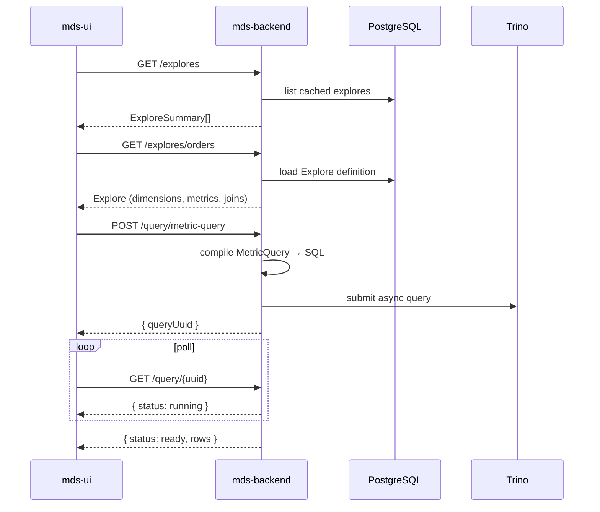

# Backend Implementation Guide for Current mds-ui

This document describes **what to implement in mds-backend and mds-worker** so the **existing Angular UI works unchanged** with real data instead of mocks.

**Scope**

- The UI in this repo stays as-is (same routes, same API calls, same response shapes).
- No new MDS platform pages, no navigation changes.
- Focus: dbt metadata display, query execution via Trino, dashboards/charts persistence, and how the four repos connect.

**Out of scope here**

- Future UI evolution (Model Runs page, Governance, etc.) — see the separate UI Evolution Agent when you reach that phase.
- Frontend refactors (adapter pattern, new services).

---

## 1. What the UI does today

### 1.1 Routes and features

| Route | Page | What it displays |
|---|---|---|
| `/projects` | Project picker | List of projects |
| `/projects/:id/tables` | Tables workspace | Explore list, field picker, chart preview, filters |
| `/projects/:id/tables/:tableId` | Same page, table selected | Explore detail + run query |
| `/projects/:id/lineage` | dbt Lineage | Graph, column lineage, folder tree, node detail panel |
| `/projects/:id/dashboards` | Dashboard list | Saved dashboards |
| `/projects/:id/dashboards/create` | Create dashboard | Form → POST |
| `/projects/:id/dashboards/:uuid` | View dashboard | Tiles; chart tiles run metric queries |
| `/projects/:id/dashboards/:uuid/edit` | Edit dashboard | Drag/resize tiles, PATCH save |
| `/projects/:id/charts` | Charts list | Saved charts |
| `/projects/:id/charts/:uuid` | Chart view | Chart or SQL runner mode |

Navigation: project switcher, Tables, Browse (dashboards). **Refresh dbt** button exists in Tables but is **disabled** — backend can implement `/refresh` later without UI changes.

### 1.2 How the UI talks to the backend

All requests go through `LightdashApiService`:

- Base path: `/api/v1/...` or `/api/v2/...`
- Envelope: `{ "status": "ok", "results": ... }` or `{ "status": "error", "error": { ... } }`
- Cookies: `withCredentials: true`

Toggle in `src/environments/environment.ts`:

```typescript
useMockApi: false  // → proxy to mds-backend on :8080
```

---

## 2. Three separate backend concerns

The current UI needs **three different data sources**. Do not conflate them.

```text
┌─────────────────────────────────────────────────────────────────┐
│                        mds-backend                              │
│                                                                 │
│  ┌──────────────┐  ┌──────────────────┐  ┌───────────────────┐  │
│  │ App metadata │  │ dbt metadata     │  │ Query engine      │  │
│  │ (PostgreSQL) │  │ (from artifacts) │  │ (Trino client)    │  │
│  └──────┬───────┘  └────────┬─────────┘  └─────────┬─────────┘  │
│         │                   │                        │            │
│  dashboards, charts    lineage, dbt-tree      explores + SQL     │
│  projects, spaces      (manifest/catalog)     execution           │
└─────────┼───────────────────┼────────────────────────┼────────────┘
          │                   │                        │
          ▼                   ▼                        ▼
     PostgreSQL         Object storage              Trino
                        (manifest.json)         (warehouse)
                              ▲
                              │ produced by
                         mds-worker
                              ▲
                              │ reads
                         mds-transform
                         (dbt Git repo)
```

| Concern | Used by | Source | Worker involved? |
|---|---|---|---|
| **App metadata** | Dashboards, charts, projects | PostgreSQL | No |
| **dbt metadata** | Lineage page, (future refresh) | dbt artifacts after compile | Yes — runs `dbt compile` / `dbt docs generate` |
| **Semantic + queries** | Tables, chart tiles, chart view | Explore definitions + Trino | Run path: worker runs `dbt run` to materialize tables; query path: backend hits Trino directly |

**Important:** The Lineage page does **not** query Trino. It reads **pre-compiled dbt metadata** (`manifest.json`, `catalog.json`). The Tables page **does** query Trino (via compiled SQL from explore definitions).

---

## 3. Exact API contract (current UI)

These are the endpoints the frontend **actually calls** today. Implement these first; ignore the ~100 other routes in `mock-api.router.ts` unless a page starts using them.

### 3.1 Bootstrap

| Method | Path | Response used |
|---|---|---|
| GET | `/api/v1/health?skipMigrationCheck=true` | App config, query limits |
| GET | `/api/v1/user` | Current user profile |
| GET | `/api/v1/org/projects` | Project list for navbar |

### 3.2 Dashboards (spec already written)

| Method | Path | Version |
|---|---|---|
| GET | `/projects/{projectUuid}/dashboards` | v1 |
| POST | `/projects/{projectUuid}/dashboards` | v1 |
| GET | `/projects/{projectUuid}/dashboards/{dashboardUuid}` | v2 |
| PATCH | `/projects/{projectUuid}/dashboards/{dashboardUuid}` | v2 |

Full contract: [`docs/dashboard/fastapi-api-spec.md`](./dashboard/fastapi-api-spec.md)  
Database schema: [`docs/dashboard/database-strategy.md`](./dashboard/database-strategy.md)

**Data source:** PostgreSQL only. No dbt, no Trino.

### 3.3 Charts

| Method | Path | Notes |
|---|---|---|
| GET | `/projects/{projectUuid}/saved` | List saved charts |
| GET | `/projects/{projectUuid}/saved/{chartUuid}` | Chart config + embedded `metricQuery` |

**Data source:** PostgreSQL. Chart stores a `MetricQuery` JSON blob; execution happens at read time via the query engine (§5).

### 3.4 Lineage (dbt metadata)

| Method | Path | TypeScript type |
|---|---|---|
| GET | `/projects/{projectUuid}/lineage` | `ProjectLineage` |
| GET | `/projects/{projectUuid}/dbt-tree` | `ProjectDbtTree` |

Expected shapes are defined in `src/app/core/models/lineage.model.ts`. Example fixture: `src/app/core/mock/fixtures/lineage.fixture.ts`.

**`ProjectLineage` includes:**

- `nodes[]` — id, name, type (`source` | `staging` | `mart` | `seed`), schema, database, columns, dbtPath, tags, materialization
- `edges[]` — `{ source, target }` dependency edges
- `columnEdges[]` — column-level lineage (optional, UI supports it)
- `dbtProject` — name, version, lastCompiledAt, model/seed/source counts

**`ProjectDbtTree` includes:**

- Folder tree mirroring `models/`, `seeds/`, `sources/` layout
- Each leaf links to a lineage node id via `lineageNodeId`

**Data source:** Parsed from dbt artifacts (§4). **Not** live reads from the Git repo on each request.

### 3.5 Explore / Tables (semantic layer + Trino)

| Method | Path | Version |
|---|---|---|
| GET | `/projects/{projectUuid}/explores` | v1 |
| GET | `/projects/{projectUuid}/explores/{tableId}` | v1 |
| POST | `/projects/{projectUuid}/query/metric-query` | v2 |
| GET | `/projects/{projectUuid}/query/{queryUuid}` | v2 |

Types: `src/app/core/models/explore.model.ts`. Fixtures: `explores.fixture.ts`, `explore-detail.fixture.ts`.

**`Explore` includes:**

- `baseTable`, `joinedTables[]`, `tables{}` with `dimensions` and `metrics`
- Each field has `sql` with `${TABLE}` placeholders (Lightdash-style)
- `targetDatabase` (UI mock uses `'trino'`)

**Query flow (already implemented in UI):**

```text
1. POST /query/metric-query  { query: MetricQuery }
   ← { queryUuid, fields, metricQuery, cacheMetadata }

2. GET /query/{queryUuid}  (poll until status === 'ready')
   ← { status: 'ready', rows: ResultRow[] }

3. UI renders table/chart from rows + fields
```

**Data source:**

- Explore **definitions** → backend semantic layer (derived from dbt — §4.3)
- Query **results** → Trino (§5)

### 3.6 SQL runner (chart view, SQL mode)

| Method | Path | Version |
|---|---|---|
| GET | `/projects/{projectUuid}/sqlRunner/tables` | v1 |
| GET | `/projects/{projectUuid}/sqlRunner/fields?tableName=&schemaName=` | v1 |
| POST | `/projects/{projectUuid}/query/sql` | v2 |
| GET | `/projects/{projectUuid}/query/{queryUuid}` | v2 |
| GET | `/projects/{projectUuid}/query/{queryUuid}/results` | v2 (newline-delimited JSON stream) |

**Data source:** Trino `information_schema` for catalog; direct SQL execution for queries.

### 3.7 Spaces (dashboard create)

| Method | Path |
|---|---|
| GET | `/projects/{projectUuid}/spaces` |

**Data source:** PostgreSQL.

### 3.8 Prepared but not wired in UI yet

| Method | Path | Notes |
|---|---|---|
| POST | `/projects/{projectUuid}/refresh` | Returns `{ jobUuid }` — button disabled in UI |
| GET | `/projects/{projectUuid}/compile-logs` | For refresh progress |
| GET | `/jobs/{jobUuid}` | Job status polling |

Implement these when connecting dbt refresh; no UI change needed to enable the button later.

---

## 4. How the backend gets dbt project data (display)

The backend **never** reads `mds-transform` directly on user requests. The flow is:

```text
mds-transform (Git)
       │
       │  clone at branch/commit
       ▼
mds-worker
       │  dbt deps
       │  dbt compile          → target/manifest.json
       │  dbt docs generate    → target/catalog.json
       │  (optional) dbt run  → materialize tables in Trino
       │
       │  upload artifacts + callback
       ▼
Object storage (S3/MinIO)
       │
       │  ingestion job
       ▼
mds-backend (PostgreSQL)
       │
       │  GET /lineage, GET /dbt-tree, GET /explores
       ▼
mds-ui
```

### 4.1 What mds-worker runs

| Command | Produces | Needed for |
|---|---|---|
| `dbt deps` | Installed packages | Compile |
| `dbt compile` | `manifest.json` | Lineage graph, dbt-tree, dependency edges |
| `dbt docs generate` | `catalog.json` | Column names, types, descriptions on lineage nodes |
| `dbt run` | Tables/views in Trino | Explore queries return real data |
| `dbt test` | `run_results.json` | Future: test status on lineage nodes |

**Minimum for Lineage page:** `dbt compile` + `dbt docs generate` (no warehouse write).

**Minimum for Tables page with real data:** above + `dbt run` against Trino.

### 4.2 Worker → backend handoff

**Option A — Push (recommended)**

```text
Worker finishes
  → uploads artifacts to s3://mds-artifacts/{project_id}/{run_id}/
  → POST /internal/projects/{id}/artifacts/ingest
      { run_id, manifest_uri, catalog_uri, git_sha, branch, status }
Backend ingests synchronously or enqueues ingestion job
```

**Option B — Poll**

```text
UI → POST /projects/{id}/refresh → backend creates job, enqueues worker
UI → GET /jobs/{jobUuid} → { status: RUNNING | DONE | ERROR }
Backend ingestion triggered on DONE
UI → GET /lineage (reads from DB, reflects new compile time)
```

Use the same job UUID pattern the mock already returns from `/refresh`.

### 4.3 Parsing manifest.json → `ProjectLineage`

`manifest.json` node keys look like:

```text
model.jaffle_shop.staging.stg_orders
source.jaffle_shop.raw.raw_orders
seed.jaffle_shop.country_codes
```

**Mapping to UI `LineageNode`:**

| manifest node | UI `type` | How to derive |
|---|---|---|
| `source.*` | `source` | `resource_type === 'source'` |
| `seed.*` | `seed` | `resource_type === 'seed'` |
| `model.*` in staging path | `staging` | Path contains `/staging/` or config tag |
| `model.*` in marts path | `mart` | Path contains `/marts/` or config tag |

**Edges:** For each node, `depends_on.nodes[]` → `{ source: dep, target: node.unique_id }`.

**Columns:** From `catalog.json` → `nodes[node_id].columns` (name, type, comment).

**Column lineage (optional):** dbt does not emit column edges by default. Options:

- Parse model SQL with `sqlglot` / dbt column lineage (dbt 1.x+ `manifest` column lineage if enabled)
- Omit `columnEdges` initially — UI works without them (column view just shows fewer cross-node edges)

**`dbtProject` summary:**

- `name`, `version` from `manifest.metadata`
- `lastCompiledAt` from ingestion timestamp
- Counts from manifest node lists

Reference implementation target: match shapes in `src/app/core/mock/fixtures/lineage.fixture.ts`.

### 4.4 Parsing project files → `ProjectDbtTree`

Two approaches:

**A. From manifest (simpler)** — Walk model/source/seed nodes, derive paths from `original_file_path`:

```text
models/staging/stg_orders.sql → folder tree + lineageNodeId = node.unique_id
```

**B. From Git tree (richer)** — Worker also uploads a file listing or backend clones read-only for tree structure only.

Recommendation: **manifest-only** for v1. Matches what the mock fixture does in `dbt-project-tree.fixture.ts`.

### 4.5 Building explores from dbt (the hard part)

The UI Tables page expects **Lightdash-style explores** (dimensions, metrics, joins) — **not** raw dbt models.

Today mocks hand-craft explores in `explore-detail.fixture.ts`. Your `mds-transform` project currently has SQL + `sources.yml` but **no semantic schema** defining metrics/dimensions.

**You must choose one strategy:**

| Strategy | Description | Effort |
|---|---|---|
| **A. Lightdash-compatible `schema.yml`** | Add `meta` / metrics / dimensions to dbt models (Lightdash convention). Backend ports Lightdash's dbt→explore compiler. | High fidelity, most work |
| **B. MDS semantic config** | YAML/JSON in mds-transform or mds-backend mapping model → dimensions/metrics | Medium — you own the format |
| **C. Auto-explore from catalog** | One explore per mart model; all columns = dimensions; basic `count(*)` metric | Fast MVP, limited |
| **D. Static seed for dev** | Backend serves fixture-equivalent explores while warehouse integration matures | Fastest, not production |

**Recommended path:**

1. **Phase 1:** Strategy C or D — get Trino queries working with simple explores.
2. **Phase 2:** Strategy B — explicit semantic YAML checked into `mds-transform` next to models.
3. **Phase 3:** Align with Cube or full Lightdash semantic model if needed.

**Explore list** (`GET /explores`): Return a map keyed by explore name (see `ExploresMap` type). One entry per exposed mart/dimension table.

**Explore detail** (`GET /explores/{tableId}`): Full `Explore` object with `tables`, `dimensions`, `metrics`, `joinedTables`, `targetDatabase: 'trino'`.

---

## 5. How the backend queries Trino

### 5.1 Connection configuration

Store per project/environment in PostgreSQL:

```text
projects
  └── environments (dev, prod)
        └── warehouse_connections
              type: trino
              host, port, catalog, schema
              auth: username/password or OAuth
```

The UI mock uses catalog/database `jaffle_shop`, schemas `marts`, `staging`, `seeds` — align Trino catalog naming with dbt `profiles.yml` in mds-transform.

Example dbt profile target:

```yaml
jaffle_shop_trino:
  target: dev
  outputs:
    dev:
      type: trino
      host: trino.example.com
      port: 8080
      user: mds
      catalog: jaffle_shop
      schema: marts
```

### 5.2 Metric query execution

The UI sends a `MetricQuery`:

```json
{
  "exploreName": "orders",
  "dimensions": ["orders_status", "orders_order_date"],
  "metrics": ["orders_total_revenue"],
  "filters": {},
  "sorts": [],
  "limit": 500
}
```

**Backend steps:**

1. Load `Explore` for `exploreName` from semantic store (PostgreSQL cache of compiled explores).
2. **Compile to SQL** — same logic the frontend mock uses in `metric-query-sql.utils.ts`:
   - Resolve `${TABLE}` placeholders
   - Build `FROM` with joins from `joinedTables`
   - Wrap metrics in `COUNT/SUM/AVG`
   - Apply filters, sorts, `LIMIT`
3. Submit SQL to Trino (async — do not block HTTP thread).
4. Store `queryUuid` → poll status + rows in Redis or PostgreSQL.
5. Return rows in Lightdash `ResultRow` shape: `{ [fieldId]: { raw, formatted } }`.

**Tip:** Port or reimplement `buildMetricQuerySql` from the frontend as a reference — the UI already documents expected SQL shape.

### 5.3 SQL runner execution

User-written SQL (chart view SQL mode):

1. `POST /query/sql` `{ sql, limit }` → validate read-only, apply row limit
2. Execute on Trino
3. Poll `GET /query/{uuid}` for column metadata + row count
4. Stream rows via `GET /query/{uuid}/results` as **newline-delimited JSON** (UI parses line-by-line)

Catalog endpoints:

- `sqlRunner/tables` → `SELECT * FROM information_schema.tables WHERE table_catalog = ?`
- `sqlRunner/fields` → column metadata for selected table

### 5.4 Async query pattern (required)

Both metric and SQL queries use the same poll contract:

```text
POST → { queryUuid }
GET  → { status: 'running' | 'ready' | 'error' | 'expired', rows?, columns?, error? }
```

The UI polls with exponential backoff (see `ExplorerService.pollQueryResults`). Backend must keep query state for at least a few minutes.

---

## 6. End-to-end flows (by page)

### 6.1 Lineage page



No Trino connection on this page.

### 6.2 Tables workspace (Explore + query)



**Prerequisite:** mds-worker has run `dbt run` so `marts.fct_orders` etc. exist in Trino.

### 6.3 Dashboard view (chart tile)

```text
GET /saved/{chartUuid}        → metricQuery + chartConfig (PostgreSQL)
POST /query/metric-query        → compile + Trino (same as Tables)
Render chart in tile
```

Dashboard filters from the UI are merged into `metricQuery.filters` client-side before POST.

### 6.4 Dashboard CRUD

```text
PostgreSQL only — no dbt, no Trino
```

See existing dashboard docs.

---

## 7. Repository responsibilities (concrete)

### mds-transform

- dbt project (models, seeds, sources, tests)
- `profiles.yml` template (not secrets)
- **Add:** semantic definitions (schema YAML or MDS semantic config) when ready for real explores
- CI: `dbt parse`, `dbt compile` on PR

### mds-worker

```text
Input:  { project_id, git_url, branch, commit_sha, commands: ['compile','run','test'] }
Steps:  clone → dbt deps → dbt compile → dbt docs generate → dbt run → dbt test
Output: artifacts in object storage, callback to backend, job status
```

Does **not** serve HTTP to the browser. Does **not** answer lineage API calls.

### mds-backend

| Module | Reads | Writes |
|---|---|---|
| `platform` | — | health, user stub |
| `projects` | PostgreSQL | projects, spaces, warehouse connections |
| `dashboards` | PostgreSQL | dashboard CRUD |
| `charts` | PostgreSQL | saved charts |
| `artifacts` | S3 | ingest manifest/catalog → lineage tables |
| `lineage` | PostgreSQL | serve `/lineage`, `/dbt-tree` |
| `semantic` | PostgreSQL | compile & serve `/explores` |
| `query` | Trino | `/query/metric-query`, `/query/sql`, poll, stream |
| `jobs` | PostgreSQL | `/refresh`, `/jobs/{uuid}` — enqueue worker jobs |

### mds-ui (this repo)

**No changes required** to integrate — only `useMockApi: false` and a working backend on port 8080.

---

## 8. PostgreSQL schema (beyond dashboards)

In addition to dashboard tables (see `docs/dashboard/database-strategy.md`):

```text
-- Worker / dbt state
artifact_runs (id, project_id, git_sha, branch, status, started_at, finished_at, manifest_uri, catalog_uri)
dbt_nodes (unique_id, project_id, name, type, schema, database, dbt_path, materialization, description, tags, columns jsonb)
dbt_edges (project_id, source_id, target_id)

-- Semantic layer
explores (project_id, name, definition jsonb, compiled_at)
explores refreshed when artifacts ingested OR semantic YAML changes

-- Query runtime
async_queries (query_uuid, project_id, sql, status, rows jsonb, error, created_at)

-- Warehouse
warehouse_connections (project_id, environment, type, config jsonb encrypted)
```

---

## 9. Implementation order (backend only)

Aligned to **current UI**, smallest risk first:

| Phase | Deliver | Unblocks |
|---|---|---|
| **B0** | FastAPI skeleton, envelope middleware, health, user stub, org/projects | App boot, project list |
| **B1** | Dashboard CRUD (spec exists) | Dashboard list/create/view/edit |
| **B2** | Charts CRUD + spaces | Chart list/view, dashboard tiles referencing charts |
| **B3** | Trino connection + SQL runner + async query poll/stream | Chart view SQL mode |
| **B4** | Semantic layer (simple auto-explore) + metric query compile + Trino | Tables workspace, chart tiles with data |
| **B5** | mds-worker compile pipeline + artifact ingestion | Lineage page from real dbt |
| **B6** | mds-worker dbt run + refresh endpoint + job polling | Refresh dbt button (enable in UI when ready) |
| **B7** | Richer semantic layer, column lineage, dbt test status | Lineage detail enrichment |

**Suggested first milestone:** B0 + B1 (dashboards only) — proves backend ↔ UI wiring.

**Suggested second milestone:** B3 + B4 with Strategy C explores — Tables page queries real Trino data.

**Suggested third milestone:** B5 — Lineage page from real `mds-transform` artifacts.

---

## 10. Local development topology

```text
Terminal 1: docker compose up          # postgres, minio, trino (mds-backend repo)
Terminal 2: mds-backend :8080          # API
Terminal 3: mds-worker                 # optional until B5
Terminal 4: mds-ui                     # ng serve, useMockApi: false
```

Trino must expose the schemas dbt materializes (`jaffle_shop.marts.*`, etc.). For local dev, run `dbt run` once against local Trino before testing Tables.

---

## 11. Gaps in the current repo vs production backend

| Topic | Current mds-ui mock | Production backend needs |
|---|---|---|
| Lineage data | Hand-crafted fixture from embedded `jaffle_shop` | Parse real manifest/catalog from mds-transform |
| Explores | Hand-crafted dimensions/metrics | Semantic layer from dbt + config |
| Query results | In-memory fake rows | Trino execution |
| dbt refresh | Mock job UUID | Real mds-worker job |
| Auth | Mock user always logged in | Session/OIDC |
| Embedded dbt in UI | `src/app/core/mock/dbt/jaffle_shop/` | **Reference only** — production source is mds-transform |

---

## 12. What the previous version of this doc got wrong

The earlier `MDS_BACKEND_PLATFORM_SETUP.md` mixed in:

- Future MDS navigation and pages (Model Runs, Governance, etc.)
- New Layer B API prefixes the current UI does not call
- Frontend adapter refactors you explicitly do not want yet

**This document replaces that scope** for backend planning. The four-repo split (backend / worker / transform / ui) still applies; the implementation priority is **what the UI calls today**.

---

## 13. Related files in mds-ui

| Purpose | Path |
|---|---|
| API client | `src/app/core/api/lightdash-api.service.ts` |
| Mock routes (full list) | `src/app/core/mock/mock-api.router.ts` |
| Lineage types | `src/app/core/models/lineage.model.ts` |
| Lineage fixture | `src/app/core/mock/fixtures/lineage.fixture.ts` |
| Explore types | `src/app/core/models/explore.model.ts` |
| SQL compile reference | `src/app/features/explorer/metric-query-sql.utils.ts` |
| Dashboard API spec | `docs/dashboard/fastapi-api-spec.md` |
| Sample dbt project | `src/app/core/mock/dbt/jaffle_shop/` |

---

## 14. Open decisions

1. **Semantic layer format** — Lightdash meta vs custom MDS YAML vs auto-explore (§4.5)
2. **Column lineage** — Required for v1 or defer?
3. **Trino auth** — Password, OAuth, or service account per environment?
4. **Worker orchestration** — Argo Workflows vs Redis queue + container
5. **Explore invalidation** — Rebuild explores on every `dbt compile` or on semantic file change only?

---

*Last updated: 2026-07-17 — scoped to current mds-ui only.*
