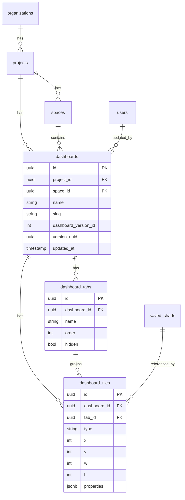

# Dashboard database strategy

This document recommends how to persist dashboard data for the FastAPI backend that serves the Angular dashboard feature.

---

## Design goals

1. **Match the API contract** — store enough to produce the `Dashboard` and list responses without ad-hoc transformation.
2. **Support full-snapshot updates** — the edit page sends the entire `tabs` + `tiles` arrays on save; the DB layer should handle replace semantics efficiently.
3. **Allow future tile types** — `properties` varies by tile type; avoid rigid per-type columns early on.
4. **Enable versioning** — the API exposes `dashboardVersionId` and `versionUuid`; plan for audit/history without blocking MVP.
5. **Keep queries fast** — list endpoint should not load all tile JSON for every dashboard.

---

## Recommended approach: normalized core + JSONB properties

Use **PostgreSQL** (best fit: JSONB, UUID, transactions, row-level locking). SQLite is fine for local dev with the same schema.

### Why not a single JSON document per dashboard?

Storing the whole dashboard as one JSON blob is simplest for snapshot updates, but it makes:

- listing dashboards expensive (must parse full JSON),
- chart reference validation harder,
- partial indexing impossible,
- concurrent edits riskier.

A **hybrid** model gives the best balance for this feature.

### Why not fully normalized tile properties?

Each tile type has different `properties`. SQL columns per type (`heading_text`, `markdown_content`, …) explode as types grow (`sql_chart`, `loom`, `data_app` are already in the enum). **JSONB for `properties`** matches the API and frontend discriminated union.

---

## Entity relationship overview



---

## Table definitions (PostgreSQL)

### `dashboards`

Holds dashboard metadata and fields not tied to individual tiles.

```sql
CREATE TABLE dashboards (
    dashboard_uuid        UUID PRIMARY KEY DEFAULT gen_random_uuid(),
    project_uuid          UUID NOT NULL REFERENCES projects(project_uuid) ON DELETE CASCADE,
    organization_uuid     UUID NOT NULL,
    space_uuid            UUID NOT NULL REFERENCES spaces(space_uuid),
    name                  TEXT NOT NULL,
    description           TEXT,
    slug                  TEXT NOT NULL,
    dashboard_version_id  INTEGER NOT NULL DEFAULT 1,
    version_uuid          UUID NOT NULL DEFAULT gen_random_uuid(),
    updated_at            TIMESTAMPTZ NOT NULL DEFAULT now(),
    updated_by_user_uuid  UUID REFERENCES users(user_uuid),
    views                 INTEGER NOT NULL DEFAULT 0,
    first_viewed_at       TIMESTAMPTZ,
    pinned_list_uuid      UUID,
    pinned_list_order     INTEGER,
    filters               JSONB NOT NULL DEFAULT '{"dimensions":[],"metrics":[],"tableCalculations":[]}',
    inherits_from_org_or_project BOOLEAN NOT NULL DEFAULT false,
    access                JSONB,
    color_palette_uuid    UUID,
    verification          JSONB,
    config                JSONB NOT NULL DEFAULT '{"isDateZoomDisabled":false}',
    created_at            TIMESTAMPTZ NOT NULL DEFAULT now(),

    UNIQUE (project_uuid, slug)
);

CREATE INDEX idx_dashboards_project ON dashboards (project_uuid);
CREATE INDEX idx_dashboards_space ON dashboards (space_uuid);
CREATE INDEX idx_dashboards_updated_at ON dashboards (project_uuid, updated_at DESC);
```

### `dashboard_tabs`

```sql
CREATE TABLE dashboard_tabs (
    tab_uuid       UUID PRIMARY KEY DEFAULT gen_random_uuid(),
    dashboard_uuid UUID NOT NULL REFERENCES dashboards(dashboard_uuid) ON DELETE CASCADE,
    name           TEXT NOT NULL,
    tab_order      INTEGER NOT NULL,
    hidden         BOOLEAN NOT NULL DEFAULT false,

    UNIQUE (dashboard_uuid, tab_order)
);

CREATE INDEX idx_dashboard_tabs_dashboard ON dashboard_tabs (dashboard_uuid);
```

### `dashboard_tiles`

```sql
CREATE TABLE dashboard_tiles (
    tile_uuid      UUID PRIMARY KEY DEFAULT gen_random_uuid(),
    dashboard_uuid UUID NOT NULL REFERENCES dashboards(dashboard_uuid) ON DELETE CASCADE,
    tab_uuid       UUID REFERENCES dashboard_tabs(tab_uuid) ON DELETE SET NULL,
    type           TEXT NOT NULL CHECK (type IN (
        'saved_chart', 'sql_chart', 'markdown', 'loom', 'heading', 'data_app'
    )),
    x              SMALLINT NOT NULL CHECK (x >= 0 AND x < 36),
    y              SMALLINT NOT NULL CHECK (y >= 0),
    w              SMALLINT NOT NULL CHECK (w >= 1 AND w <= 36),
    h              SMALLINT NOT NULL CHECK (h >= 1),
    properties     JSONB NOT NULL DEFAULT '{}',

    CHECK (x + w <= 36)
);

CREATE INDEX idx_dashboard_tiles_dashboard ON dashboard_tiles (dashboard_uuid);
CREATE INDEX idx_dashboard_tiles_tab ON dashboard_tiles (tab_uuid);
CREATE INDEX idx_dashboard_tiles_type ON dashboard_tiles (dashboard_uuid, type);

-- Fast lookup: which dashboards reference a chart?
CREATE INDEX idx_dashboard_tiles_saved_chart
    ON dashboard_tiles ((properties->>'savedChartUuid'))
    WHERE type = 'saved_chart';
```

### Optional: `dashboard_tile_types` denormalization

For the list endpoint, the frontend expects `tileTypes: string[]`. Two options:

**Option A — compute at read time (recommended for MVP)**

```sql
SELECT array_agg(DISTINCT type ORDER BY type) AS tile_types
FROM dashboard_tiles
WHERE dashboard_uuid = $1;
```

**Option B — denormalize on `dashboards`**

Add `tile_types TEXT[]` and refresh on every update inside the same transaction. Faster list queries, slightly more write logic.

---

## Mapping DB rows ↔ API models

### GET detail

1. Load `dashboards` row by `(project_uuid, dashboard_uuid)`.
2. Load `dashboard_tabs` ordered by `tab_order`.
3. Load `dashboard_tiles` for that dashboard.
4. Join `spaces` for `spaceName`, `users` for `updatedByUser`.
5. Assemble camelCase JSON response.

### List

1. Query `dashboards` for `project_uuid` with pagination.
2. For each row, compute `tileTypes` (aggregate or denormalized column).
3. Do **not** load tile positions or properties.

### PATCH (full snapshot)

Use a **single transaction**:

```python
async def save_dashboard_snapshot(dashboard_uuid: UUID, tabs: list, tiles: list, meta: dict):
    async with db.transaction():
        # 1. Update dashboard metadata + bump version
        await db.execute("""
            UPDATE dashboards
            SET name = :name,
                description = :description,
                slug = :slug,
                dashboard_version_id = dashboard_version_id + 1,
                version_uuid = :version_uuid,
                updated_at = :updated_at,
                updated_by_user_uuid = :user_uuid
            WHERE dashboard_uuid = :dashboard_uuid
        """, meta)

        # 2. Replace tabs: delete all, re-insert
        await db.execute(
            "DELETE FROM dashboard_tabs WHERE dashboard_uuid = :id",
            {"id": dashboard_uuid},
        )
        await db.executemany("INSERT INTO dashboard_tabs ...", tabs)

        # 3. Replace tiles: delete all, re-insert
        await db.execute(
            "DELETE FROM dashboard_tiles WHERE dashboard_uuid = :id",
            {"id": dashboard_uuid},
        )
        await db.executemany("INSERT INTO dashboard_tiles ...", tiles)
```

**Why delete + re-insert?** The frontend treats save as a full snapshot. Diffing tiles by UUID is possible but adds complexity with little benefit at typical dashboard sizes (tens of tiles, not thousands).

**Preserve tile UUIDs** — the client generates `crypto.randomUUID()` for new tiles and expects them to round-trip. Insert using client-provided UUIDs, not DB-generated ones.

---

## Versioning and audit history

The API exposes:

- `dashboardVersionId` — monotonic integer per dashboard
- `versionUuid` — new UUID on each save

### MVP (current frontend needs)

Increment `dashboard_version_id` and rotate `version_uuid` on every successful `PATCH`. No history table required.

### Phase 2 (recommended)

Add an append-only history table for rollback and audit:

```sql
CREATE TABLE dashboard_versions (
    version_uuid          UUID PRIMARY KEY,
    dashboard_uuid        UUID NOT NULL REFERENCES dashboards(dashboard_uuid) ON DELETE CASCADE,
    dashboard_version_id  INTEGER NOT NULL,
    snapshot              JSONB NOT NULL,  -- full tabs + tiles + metadata at save time
    created_at            TIMESTAMPTZ NOT NULL DEFAULT now(),
    created_by_user_uuid  UUID,

    UNIQUE (dashboard_uuid, dashboard_version_id)
);
```

On each `PATCH`, insert into `dashboard_versions` **before** replacing tabs/tiles. The snapshot JSON can be the exact request body plus resolved metadata.

### Phase 3 (collaborative editing)

If multiple editors become a requirement:

- Add optimistic locking: `PATCH` requires `If-Match: {versionUuid}` header; return `409 Conflict` on mismatch.
- Or move to event-sourced tile ops — not needed for the current UI.

---

## JSONB `properties` schemas per tile type

Validate at the application layer (Pydantic) before insert:

| `type` | Expected `properties` keys |
|---|---|
| `saved_chart` | `title?`, `hideTitle?`, `savedChartUuid`, `chartName?`, `lastVersionChartKind?` |
| `markdown` | `title`, `content`, `hideFrame?` |
| `heading` | `text`, `showDivider?` |

Example JSONB payloads:

```json
-- saved_chart
{"title": "Revenue", "savedChartUuid": "...", "chartName": "Revenue", "lastVersionChartKind": "vertical_bar"}

-- markdown
{"title": "Notes", "content": "Some **markdown** text."}

-- heading
{"text": "Section title", "showDivider": true}
```

Optional PostgreSQL check constraints for known types:

```sql
ALTER TABLE dashboard_tiles ADD CONSTRAINT saved_chart_props CHECK (
    type != 'saved_chart' OR (properties ? 'savedChartUuid')
);
```

---

## Referential integrity for charts

`saved_chart` tiles reference `savedChartUuid`. Strategies:

| Strategy | Pros | Cons |
|---|---|---|
| **Soft reference** (no FK) | Simple; charts can be deleted independently | Orphan tiles possible |
| **FK to `saved_charts`** | Strong integrity | Must handle chart deletion (cascade / null / block) |
| **FK + ON DELETE SET NULL** | Dashboard survives chart deletion | Tile shows empty state in UI |

**Recommendation:** FK with `ON DELETE SET NULL` on the application side (validate `savedChartUuid` exists on save; allow null if chart was deleted). Block save only if you want strict mode.

---

## Indexing and performance

| Query | Index |
|---|---|
| List dashboards in project | `(project_uuid, updated_at DESC)` |
| Load dashboard detail | PK on `dashboard_uuid` + `(dashboard_uuid)` on tabs/tiles |
| Find dashboards using a chart | Expression index on `properties->>'savedChartUuid'` |
| Filter private dashboards | Depends on ACL model — likely `(project_uuid, space_uuid)` |

Typical dashboard: 1–5 tabs, 5–30 tiles. Full snapshot replace is sub-millisecond for writes at this scale.

---

## Migration path from mock data

1. Create tables above.
2. Seed from `src/app/core/mock/fixtures/dashboards.fixture.ts` for dev parity.
3. Wire FastAPI repository layer.
4. Flip `useMockApi: false` in Angular environment.

Example seed shape:

```python
DASHBOARD = {
    "dashboard_uuid": "d4e5f6a7-b8c9-0123-def0-234567890123",
    "name": "Executive Overview",
    "tabs": [{"tab_uuid": "...", "name": "Overview", "tab_order": 0}],
    "tiles": [
        {
            "tile_uuid": "...",
            "type": "heading",
            "x": 0, "y": 0, "w": 36, "h": 2,
            "properties": {"text": "Executive summary", "showDivider": True},
        },
    ],
}
```

---

## Alternative strategies (when to choose them)

### A. Document store (MongoDB, single JSON column)

**Choose if:** dashboards are deeply nested, versioning is document-snapshot based, and you rarely query inside tiles.

**Trade-off:** harder SQL joins for chart lineage, weaker constraints on grid positions.

### B. Event sourcing (tile move events)

**Choose if:** you need real-time multi-user collaboration with granular undo.

**Trade-off:** significant complexity; current frontend does not emit events, only full snapshots.

### C. Normalized properties (per-type tables)

**Choose if:** you need heavy analytics on tile content (e.g. full-text search across markdown tiles).

**Trade-off:** many tables, complex migrations as types grow. JSONB + GIN index is usually enough:

```sql
CREATE INDEX idx_dashboard_tiles_properties_gin ON dashboard_tiles USING GIN (properties);
```

---

## Suggested SQLAlchemy models (sketch)

```python
from sqlalchemy import Column, String, Integer, SmallInteger, Boolean, ForeignKey, Text
from sqlalchemy.dialects.postgresql import UUID, JSONB, TIMESTAMP
from sqlalchemy.orm import relationship

class Dashboard(Base):
    __tablename__ = "dashboards"
    dashboard_uuid = Column(UUID, primary_key=True)
    project_uuid = Column(UUID, ForeignKey("projects.project_uuid"), nullable=False)
    name = Column(Text, nullable=False)
    slug = Column(Text, nullable=False)
    dashboard_version_id = Column(Integer, nullable=False, default=1)
    version_uuid = Column(UUID, nullable=False)
    # ... other metadata columns

    tabs = relationship("DashboardTab", cascade="all, delete-orphan")
    tiles = relationship("DashboardTile", cascade="all, delete-orphan")

class DashboardTab(Base):
    __tablename__ = "dashboard_tabs"
    tab_uuid = Column(UUID, primary_key=True)
    dashboard_uuid = Column(UUID, ForeignKey("dashboards.dashboard_uuid"), nullable=False)
    name = Column(Text, nullable=False)
    tab_order = Column(Integer, nullable=False)

class DashboardTile(Base):
    __tablename__ = "dashboard_tiles"
    tile_uuid = Column(UUID, primary_key=True)
    dashboard_uuid = Column(UUID, ForeignKey("dashboards.dashboard_uuid"), nullable=False)
    tab_uuid = Column(UUID, ForeignKey("dashboard_tabs.tab_uuid"))
    type = Column(String, nullable=False)
    x = Column(SmallInteger, nullable=False)
    y = Column(SmallInteger, nullable=False)
    w = Column(SmallInteger, nullable=False)
    h = Column(SmallInteger, nullable=False)
    properties = Column(JSONB, nullable=False, default=dict)
```

Use **Alembic** for migrations.

---

## Summary recommendation

| Layer | Choice |
|---|---|
| Database | PostgreSQL |
| Dashboard metadata | Relational `dashboards` table |
| Tabs | Relational `dashboard_tabs` table |
| Tile layout (`x,y,w,h,type`) | Relational columns with CHECK constraints |
| Tile content | JSONB `properties` |
| Updates | Transactional full snapshot replace |
| Versioning (MVP) | Increment `dashboard_version_id`, rotate `version_uuid` |
| Versioning (later) | Append-only `dashboard_versions` with JSONB snapshot |
| List performance | Aggregate `tileTypes` at query time or denormalize |

This maps cleanly to what the Angular edit page already sends and keeps room to grow without breaking the API contract.
