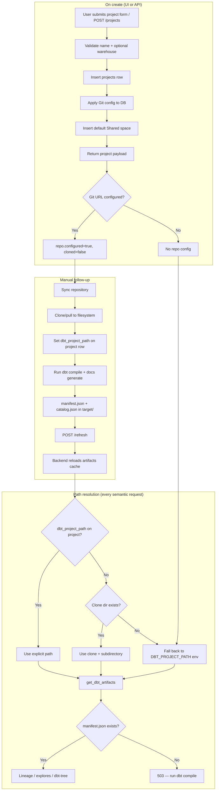

# Project setup flow

This document describes what happens when a user sets up a project in LightDashAngular — from the create form or API through Git sync, dbt artifacts, and when each feature becomes usable.

**Scope**

- Project creation (UI and API)
- Git repository sync
- dbt artifact path resolution
- Warehouse association
- Manual follow-up steps

**Out of scope**

- Dashboard tile editing, chart persistence, or warehouse CRUD details — see [dashboard documentation](./dashboard/README.md) and [backend platform setup](./MDS_BACKEND_PLATFORM_SETUP.md).

---

## 1. High-level overview

Project setup is **metadata-first**. Creating a project writes configuration to PostgreSQL and creates a default **Shared** space. It does **not**:

- Clone a Git repository
- Run `dbt compile` or `dbt docs generate`
- Generate or upload dbt artifacts

Semantic features (lineage, dbt-tree, explores) depend on **filesystem dbt artifacts** (`manifest.json`, optionally `catalog.json`) at a resolved path. Those artifacts must be produced manually (or by a future `mds-worker`) after setup.

Dashboards work immediately after create because they only need the project row and default space in the database.

---

## 2. Create via UI and API

### 2.1 UI — `/projects/create`

**On page load**

| Call | Purpose |
|------|---------|
| `GET /api/v1/warehouses` | Populate optional warehouse dropdown |

**Form fields**

| Field | Required | Notes |
|-------|----------|-------|
| Project name | Yes | Trimmed; empty name blocked client-side |
| Warehouse | No | Select existing warehouse, or open "Create warehouse" dialog → `POST /api/v1/warehouses` |
| Repository URL | No | HTTPS Git remote |
| Provider | No | Auto-detect, or GitHub / GitLab / Bitbucket / Generic |
| Default branch | No | Defaults to `main` |
| Subdirectory | No | Monorepo path to dbt project (e.g. `transform`) |
| Access token | No | For private repos; sent once, stored encrypted server-side |

**On submit**

- Single call: `POST /api/v1/projects` with camelCase body.
- On success: project added to client state, set as active project, redirect to `/projects/{projectUuid}/dashboards`.
- **No** sync, dbt compile, or refresh is triggered from the create page.

### 2.2 API — `POST /api/v1/projects`

Same backend logic as the UI (`platform.py` → `create_project`).

**Request body** (`ProjectCreate`):

```json
{
  "name": "Acme Analytics",
  "warehouseUuid": "optional-warehouse-uuid",
  "gitRepoUrl": "https://github.com/acme/dbt.git",
  "gitDefaultBranch": "main",
  "gitProvider": "github",
  "gitSubdirectory": "transform",
  "gitToken": "ghp_..."
}
```

**Backend steps**

1. Validate non-empty `name`.
2. If `warehouseUuid` provided → validate UUID, load warehouse (404 if missing), set `warehouse_uuid` and `warehouse_type` from warehouse; else default `warehouse_type = "trino"`.
3. Create `Project` with new UUID, link to mock user if present.
4. `apply_git_fields_on_create()` — store Git URL, branch, subdirectory, provider (auto-detect from hostname if omitted), encrypt token.
5. Create default `Space` named **"Shared"** (`is_private=false`).
6. Commit and return enriched payload via `project_payload()`.

**Important:** Git config is stored only. `repo.cloned` stays `false` until an explicit sync.

---

## 3. With Git repo vs without Git

### 3.1 With Git repo configured

**On create**

- DB only: `git_repo_url`, `git_default_branch`, `git_provider`, `git_subdirectory`, `encrypted_git_token`.
- `dbt_project_path` is **not** set yet.
- Response includes `repo: { configured: true, cloned: false }`.
- Nothing is written under `PROJECTS_DATA_DIR`.

**On sync** (see section 4): clone path is set and `dbt_project_path` is updated on the project row.

### 3.2 Without Git repo — `DBT_PROJECT_PATH` fallback

Path resolution (`resolve_project_dbt_path` → `get_dbt_artifacts`):

1. **`project.dbt_project_path`** on the DB row (set after sync, or manually) — highest priority.
2. **Cloned repo path** if `{PROJECTS_DATA_DIR}/{uuid}/repo/` exists.
3. **`None`** → loader falls back to global `DBT_PROJECT_PATH` in `mds-backend/.env` (default `../mds-transform`).

A project with no Git and no per-project path shares the global dev dbt directory. All such projects read the same artifacts unless paths differ.

Artifacts are read from `{dbt_project_path}/target/` (or `DBT_ARTIFACTS_PATH` if set). Missing `manifest.json` → **503** with a message to run `dbt compile` and `dbt docs generate`.

**Per-project override:** set `dbt_project_path` on the project row (via sync or direct DB edit) to point at a specific directory, overriding the global env var.

---

## 4. Sync repository flow

Triggered from the **project edit/settings** page (not create): `POST /api/v1/projects/{uuid}/sync`.

Backend (`sync_project_repo` in `mds/services/project/git.py`):

1. Build clone URL; inject token (GitHub: `x-access-token`, Bitbucket: `x-token-auth`, others: `oauth2`).
2. Target directory: `{PROJECTS_DATA_DIR}/{projectUuid}/repo` (default `.data/projects/{uuid}/repo`).
3. **First sync:** shallow clone (`--depth 1`) of `git_default_branch` (default `main`).
4. **Later syncs:** update remote URL, fetch, checkout branch, `pull --ff-only`.
5. Update DB:
   - `dbt_project_path` → clone root, or `{clone}/{git_subdirectory}` if subdirectory exists
   - `git_last_commit_sha`
   - `git_last_sync_at`
6. Return full repo status (`GET /repo`-style payload).

Sync clones **source SQL/YAML only**. It does **not** run `dbt compile` or `dbt docs generate`.

**Repo status:** `GET /api/v1/projects/{uuid}/repo` returns `configured`, `cloned`, `clonePath`, `branch`, `commitSha`, `lastSyncAt`, and resolved `dbtProjectPath`.

### 4.1 Desync (remove local clone)

Triggered from **project edit/settings**: `POST /api/v1/projects/{uuid}/desync` ("Remove local clone").

Backend (`desync_project_repo`):

1. Delete `{PROJECTS_DATA_DIR}/{projectUuid}/repo/` if it exists.
2. Clear sync metadata on the project row:
   - `git_last_sync_at`, `git_last_commit_sha`
   - `dbt_project_path` only when it pointed at the clone path (manual overrides are kept)
3. **Keep** Git config: `git_repo_url`, branch, token, provider, subdirectory.
4. Return full repo status (`cloned: false`).

After desync, dbt path resolution falls back to global `DBT_PROJECT_PATH` when no other override applies.

---

## 5. Warehouse association

Warehouses are separate entities (`warehouses` table). They are **not** created automatically with a project.

| When | Behavior |
|------|----------|
| **Create** | Optional `warehouseUuid` FK on the project |
| **Update** | `PATCH /api/v1/projects/{uuid}` can set, change, or clear `warehouseUuid` |
| **Defaults** | `warehouse_type` copied from linked warehouse; defaults to `"trino"` if none |

Used for:

- Display (`warehouseName` in API responses)
- Live query execution via Trino (`get_connection_for_project`)
- Lineage metadata (`warehouse_type` on graph nodes)

Warehouse assignment is optional for project creation and for dashboards. It is required for **live warehouse queries** against explores.

---

## 6. DB vs filesystem storage

### Database (on create)

| Table | What |
|-------|------|
| `projects` | UUID, name, `warehouse_uuid`, `warehouse_type`, Git fields, `created_by_user_uuid`, timestamps. `dbt_project_path` null until sync. |
| `spaces` | One row: `"Shared"`, public, tied to project UUID |

### Database (on sync only)

| Field | Value |
|-------|-------|
| `dbt_project_path` | Resolved clone path (+ subdirectory) |
| `git_last_commit_sha` | Current HEAD |
| `git_last_sync_at` | UTC timestamp |

### Filesystem

| When | Where | What |
|------|-------|------|
| After sync | `.data/projects/{uuid}/repo/` | Full Git clone (dbt source) |
| After desync | — | Clone removed; Git config remains in DB |
| After manual dbt | `{dbt_project_path}/target/` | `manifest.json`, `catalog.json` (not written by backend today) |
| Never on create | — | No clone, no artifacts |

Tokens and warehouse passwords are encrypted at rest; raw tokens are not returned in API responses (`hasGitToken: true/false` only).

---

## 7. Manual steps after setup

| Step | When | Why |
|------|------|-----|
| **Create warehouse** (optional) | Before or during project setup | Needed for Trino query execution |
| **Sync repository** | Git-backed projects | Create does not clone; use project settings → "Sync repository" or `POST .../sync` |
| **Remove local clone** | Synced Git projects | Keeps Git settings; clears clone and sync metadata via `POST .../desync` |
| **`dbt deps && dbt compile && dbt docs generate`** | Always, for lineage/explores | Backend reads artifacts; sync only fetches source |
| **`POST /api/v1/projects/{uuid}/refresh`** | After new/changed artifacts | Clears in-memory cache and reloads from disk |
| **Restart backend** | Alternative to refresh | Same effect for artifact cache |

**Not implemented yet:** `mds-worker` (planned Phase B5) would automate clone → compile → upload. Today that is manual.

---

## 8. When features become usable

| Feature | Ready after create? | Requirements |
|---------|---------------------|--------------|
| **Project list / switcher** | Yes | Create succeeds |
| **Dashboards** | Yes | Default "Shared" space exists; create/list dashboards in DB |
| **Lineage** | No | `manifest.json` at resolved dbt path |
| **dbt-tree** | No | Same |
| **Explores** | No | Same (+ `catalog.json` for rich column metadata) |
| **Live queries on explores** | No | Explores + warehouse assigned + Trino connectivity |

### Typical paths to "fully usable"

**Git-backed**

1. Create project (with Git URL).
2. Open project settings → Sync repository.
3. In clone dir: `dbt deps && dbt compile && dbt docs generate`.
4. `POST .../refresh`.
5. Optionally assign warehouse for queries.

**Local / no Git (dev)**

1. Set `DBT_PROJECT_PATH` in backend `.env`.
2. Create project (no Git needed).
3. Ensure artifacts exist under that path's `target/`.
4. Lineage/explores work immediately (all no-Git projects share that path unless overridden).

---

## 9. API quick reference

| Action | Method | Path |
|--------|--------|------|
| List warehouses (create form) | GET | `/api/v1/warehouses` |
| Create warehouse | POST | `/api/v1/warehouses` |
| Create project | POST | `/api/v1/projects` |
| Get / update project | GET / PATCH | `/api/v1/projects/{uuid}` |
| Repo status | GET | `/api/v1/projects/{uuid}/repo` |
| Sync Git | POST | `/api/v1/projects/{uuid}/sync` |
| Desync Git (remove clone) | POST | `/api/v1/projects/{uuid}/desync` |
| Reload dbt artifacts | POST | `/api/v1/projects/{uuid}/refresh` |
| Lineage | GET | `/api/v1/projects/{uuid}/lineage` |
| dbt-tree | GET | `/api/v1/projects/{uuid}/dbt-tree` |
| Explores | GET | `/api/v1/projects/{uuid}/explores` |
| Dashboards | GET / POST | `/api/v1/projects/{uuid}/dashboards` |

All responses use the LightDash envelope: `{ "status": "ok", "results": ... }` or `{ "status": "error", "error": { ... } }`.

---

## 10. Flow diagram



---

**Bottom line:** Create registers the project, optional warehouse link, and optional Git config, plus a default space. Semantic layer and lineage depend on **filesystem dbt artifacts** at a resolved path (synced clone or `DBT_PROJECT_PATH`). Dashboards work right away; lineage and explores need a sync (if Git) and a manual `dbt compile` / `dbt docs generate` step until background worker automation exists.
