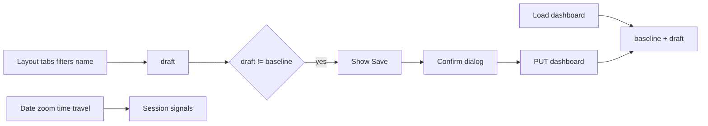

# Dashboard always-edit UX

## Design (approved)

**Approach:** Merge edit capabilities into [`dashboard-view-page`](mds-ui/src/app/features/dashboards/dashboard-view-page/); delete the separate edit experience.

**Locked decisions:**
- One URL: `/projects/:projectUuid/dashboards/:dashboardUuid` — always fully editable (tiles, tabs, filters)
- Save appears only when dirty; click → MatDialog confirm → persist; stay on page and reset baseline
- Leave guard + `beforeunload` when dirty (discard vs stay)
- Dirty = name, description, tabs, tiles, dimension filters (vs baseline). **Not** date zoom / time travel
- Name: plain text + small edit icon (inline/popover rename)
- Date zoom + time travel in the **title-row actions** (session-only); dimension filters stay in filters bar (always editable, dirty)
- Tabs: `+` left of first tab; horizontal scroll when overflow; keep reorder/rename/duplicate/hide/delete
- Redirect `.../edit` → view; remove edit page; update e2e that hits `/edit`

## Architecture

- `baseline` / `draft`: persistable snapshot (`name`, `description`, `tabs`, `tiles`, `filters`, `config` without session date zoom)
- Pure helper e.g. `isDashboardDraftDirty(baseline, draft)` for unit tests
- Save payload mirrors today’s edit `update()` but does **not** write session date zoom into `defaultDateZoomGranularity` on every zoom change (keep last saved config default; session override only)

## Key files

- Expand: [`dashboard-view-page.component.ts/html/scss`](mds-ui/src/app/features/dashboards/dashboard-view-page/) — port grid interaction, add-tile, tab CRUD from edit
- Adjust: [`dashboard-filters-bar`](mds-ui/src/app/features/dashboards/dashboard-filters-bar/) — date zoom/time travel optional/hidden when moved to header; `isEditMode` always true for filter add/edit
- Routes: [`app.routes.ts`](mds-ui/src/app/app.routes.ts) — redirect edit path; attach `canDeactivate`
- New: dirty helper + optional small confirm dialog component; `canDeactivate` guard/function
- Delete: [`dashboard-edit-page/`](mds-ui/src/app/features/dashboards/dashboard-edit-page/) after port
- Update: [`e2e/dashboard-tile-rearrangement.spec.ts`](mds-ui/e2e/dashboard-tile-rearrangement.spec.ts) URL

## UI layout (header)

1. **Title row:** name + edit icon | info | favorite — actions: date zoom, time travel, Add tile, **Save (if dirty)**, Refresh, Views, Fullscreen, More
2. **Tabs row:** `[+]` | scrollable tab strip
3. **Filters bar:** dimension filters only (no date zoom)
4. **Grid:** always-on edit chrome from current edit page

Responsive: `min-width: 0` on title/tab flex children; tab strip `overflow-x: auto`; page shell no horizontal scroll; action labels `nowrap`.

## Out of scope

- Permissions / read-only viewers
- Auto-save
- Changing backend dashboard API shape
- Share / duplicate / export (remain disabled stubs)

## Implementation order

1. Write design spec to `docs/superpowers/specs/2026-08-03-dashboard-always-edit-design.md` and commit (repo convention)
2. Dirty helper + unit tests
3. Port draft/baseline/save/confirm/leave-guard into view page; wire Save UI
4. Header/tabs/filters layout (edit icon, date controls, `+`, horizontal scroll)
5. Port tile grid edit interaction + Add tile
6. Route redirect; remove edit page; fix e2e
7. Manual smoke: dirty/clean, date zoom no Save, tab overflow scroll, leave warning
