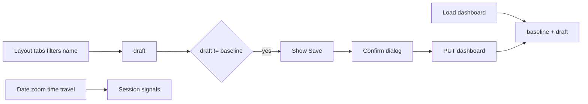

# Dashboard always-edit UX

**Date:** 2026-08-03  
**Status:** Accepted — implementation plan in `docs/superpowers/plans/2026-08-03-dashboard-always-edit.md`  
**Scope:** Unify dashboard view and edit into one always-editable page  
**Related context:** Current split between [`dashboard-view-page`](mds-ui/src/app/features/dashboards/dashboard-view-page/) and [`dashboard-edit-page`](mds-ui/src/app/features/dashboards/dashboard-edit-page/); Lightdash-style dashboard editing with dirty-gated Save

## Problem

Dashboard editing today lives on a separate route (`/projects/:projectUuid/dashboards/:dashboardUuid/edit`) while the view page is read-only for layout changes. Users must context-switch between view and edit to rearrange tiles, manage tabs, or change filters. Date zoom and time travel live in the filters bar on view but the edit page has a different chrome. Save on edit persists immediately without a confirm step aligned with other draft flows.

We need one URL where the dashboard is always fully editable, with explicit Save when persistable state changes and session-only controls (date zoom / time travel) kept out of dirty detection.

## Goals

1. **Single URL:** `/projects/:projectUuid/dashboards/:dashboardUuid` — always fully editable (tiles, tabs, dimension filters, name).
2. **Dirty-gated Save:** Show Save only when draft differs from baseline; click opens MatDialog confirm → persist → stay on page and reset baseline.
3. **Leave protection:** `canDeactivate` + `beforeunload` when dirty (discard vs stay).
4. **Session date controls:** Date zoom and time travel in the title-row actions; changes do not mark the dashboard dirty or appear in Save payload.
5. **Tabs UX:** `+` button left of first tab; horizontal scroll when overflow; keep reorder/rename/duplicate/hide/delete.
6. **Name edit:** Plain text + small edit icon (inline or popover rename).
7. **Remove edit route:** Redirect `.../edit` → view; delete edit page; update e2e URLs.

## Non-goals

- Permissions / read-only viewers
- Auto-save
- Changing backend dashboard API shape
- Share / duplicate / export (remain disabled stubs)

## Decisions (locked)

| Decision | Choice |
|----------|--------|
| URL model | One route — always editable; no separate `/edit` |
| Save UX | Button visible only when dirty; MatDialog confirm before PUT |
| Dirty scope | Name, description, tabs, tiles, dimension filters vs baseline |
| Not dirty | Date zoom, time travel (session-only signals) |
| Date controls placement | Title-row actions (header), not filters bar |
| Dimension filters | Filters bar; always editable; changes are dirty |
| Name editing | Plain text + edit icon (inline/popover) |
| Tabs add control | `+` left of first tab |
| Tab overflow | Horizontal scroll on tab strip |
| Legacy `/edit` URL | Redirect to view route |
| Save payload | Mirrors today’s edit `update()`; does **not** write session date zoom into `defaultDateZoomGranularity` on every zoom change |

## Architecture

### Draft / baseline model

- **`baseline`:** Last persisted snapshot loaded from API or refreshed after Save.
- **`draft`:** Working copy mutated by layout, tabs, filters, and name edits.
- **Persistable fields:** `name`, `description`, `tabs`, `tiles`, `filters`, `config` (excluding session date zoom override).
- **Session signals:** Date zoom granularity and time-travel range live in component/session state only until explicitly saved via a future feature (not in this project).

### Dirty detection

- Pure helper e.g. `isDashboardDraftDirty(baseline, draft)` for unit tests and UI gating.
- Deep equality (or normalized comparison) on persistable fields; ignore session date zoom signals.

### Save flow

1. User clicks Save (visible only when dirty).
2. MatDialog confirm (“Save changes to this dashboard?”).
3. On confirm: PUT dashboard with draft persistable fields (same shape as today’s edit page `update()`).
4. On success: set `baseline = draft`, hide Save, clear leave-guard dirty state.
5. User remains on the same page and URL.

### Leave guard

- Angular `canDeactivate` on the dashboard view route when dirty.
- Browser `beforeunload` when dirty (standard unsaved-changes prompt).
- Options: stay on page or discard (navigate away without save).

## Key files

| File | Role |
|------|------|
| [`dashboard-view-page/`](mds-ui/src/app/features/dashboards/dashboard-view-page/) | Expand: draft/baseline, Save, confirm dialog, grid edit, tab CRUD, header layout |
| [`dashboard-filters-bar/`](mds-ui/src/app/features/dashboards/dashboard-filters-bar/) | Hide date zoom/time travel when moved to header; `isEditMode` always true for filter add/edit |
| [`app.routes.ts`](mds-ui/src/app/app.routes.ts) | Redirect edit path → view; attach `canDeactivate` |
| New: dirty helper | `isDashboardDraftDirty(baseline, draft)` + unit tests |
| New: optional confirm dialog | Small MatDialog for Save confirm (or reuse existing pattern) |
| New: `canDeactivate` guard/function | Route leave protection |
| [`dashboard-edit-page/`](mds-ui/src/app/features/dashboards/dashboard-edit-page/) | **Delete** after port complete |
| [`e2e/dashboard-tile-rearrangement.spec.ts`](mds-ui/e2e/dashboard-tile-rearrangement.spec.ts) | Update URL from `/edit` to view route |

## UI layout (header)

1. **Title row:** name + edit icon | info | favorite — actions: date zoom, time travel, Add tile, **Save (if dirty)**, Refresh, Views, Fullscreen, More
2. **Tabs row:** `[+]` | scrollable tab strip (reorder/rename/duplicate/hide/delete unchanged)
3. **Filters bar:** dimension filters only (no date zoom)
4. **Grid:** always-on edit chrome from current edit page (drag, resize, add tile)

### Responsive constraints

- `min-width: 0` on title/tab flex children so labels truncate instead of forcing page width.
- Tab strip: `overflow-x: auto` inside a local wrapper; page shell must not scroll horizontally.
- Action button labels: `white-space: nowrap`; shorten via container query if needed — never wrap mid-label.
- Chromium + Firefox: verify dialog and flex overflow behavior on tab strip and header actions.

## Edge cases & errors

- **Save failure:** Keep draft dirty; show error snackbar; do not reset baseline.
- **Load failure:** Existing error handling unchanged; no draft/baseline until load succeeds.
- **Navigate away dirty:** Confirm discard or cancel navigation.
- **Date zoom change:** Updates session signals only; Save button stays hidden if no persistable dirty state.
- **Filter add/edit/remove:** Marks dirty; included in Save payload.
- **Tab operations:** Reorder/rename/duplicate/hide/delete mark dirty.
- **Redirect `/edit`:** Preserve dashboard UUID; land on unified view route with edit chrome active.
- **Refresh after Save:** Baseline matches server; dirty clears.

## Testing

- **Unit:** `isDashboardDraftDirty` — name, tabs, tiles, filters dirty; date zoom not dirty; baseline equality.
- **Component:** Save button visibility tied to dirty state; confirm dialog opens on Save click.
- **E2e:** Update tile rearrangement spec to view URL; smoke drag/resize/add tile on unified page.
- **Manual smoke (Chromium + Firefox):** dirty/clean Save visibility; date zoom without Save; tab overflow scroll; leave warning on navigation and tab close.

## Done when

- [ ] Single `/dashboards/:id` route is always editable (tiles, tabs, filters, name)
- [ ] Save appears only when dirty; confirm dialog → persist → baseline reset; stay on page
- [ ] `canDeactivate` + `beforeunload` when dirty
- [ ] Date zoom / time travel in header; not in dirty detection or Save payload
- [ ] Name edit icon; tabs `+` left; horizontal tab scroll
- [ ] `/edit` redirects to view; edit page deleted; e2e updated
- [ ] No horizontal page scroll; header/tabs responsive per workspace UI rules

## Open follow-ups (explicitly deferred)

- Read-only / permission-gated view mode for non-editors
- Auto-save or debounced persist
- Persisting session date zoom as new dashboard default without explicit Save semantics change
